# RNA-Seq Pipeline Flowchart

Copy this into [mermaid.live](https://mermaid.live) to visualize.

## Full Pipeline (Horizontal)

## Detailed Flowchart

Copy this into [mermaid.live](https://mermaid.live) to visualize:

```mermaid
flowchart LR
    subgraph INPUT["📥 INPUT"]
        A[🥕 Raw FASTQ Reads<br/>Carrot RNA-seq]
    end

    subgraph QC["🔍 QUALITY CONTROL"]
        B[FastQC<br/>Check read quality]
    end

    subgraph ALIGN["🧬 ALIGNMENT & COUNTING"]
        D{Reference<br/>genome?}
        
        subgraph REF["Reference-Guided Path"]
            E[STAR<br/>Align to genome]
            F[featureCounts<br/>Count reads per gene]
        end
        
        subgraph DENOVO["De Novo Path"]
            G[Trinity<br/>Assemble transcripts]
            H[RSEM<br/>Quantify expression]
        end
    end

    subgraph ANALYSIS["📊 DIFFERENTIAL EXPRESSION"]
        I[Count Matrix<br/>Read counts per gene]
        J[PyDESeq2<br/>Find DE genes]
        K[CYP Heatmap<br/>Visualize expression]
    end

    subgraph OUTPUT["📤 OUTPUT"]
        L[🎯 Candidate Genes<br/>CYP450s, etc.]
    end

    A --> B
    B --> D
    
    D -->|"✅ Yes<br/>(Carrot genome)"| E
    D -->|"❌ No"| G
    
    E --> F
    G --> H
    
    F --> I
    H --> I
    
    I --> J
    J --> K
    K --> L

    style A fill:#f9d5d3
    style B fill:#ffeaa7
    style D fill:#dfe6e9
    style E fill:#a8e6cf
    style F fill:#fdcb6e
    style G fill:#a8e6cf
    style H fill:#fdcb6e
    style I fill:#74b9ff
    style J fill:#a29bfe
    style K fill:#fd79a8
    style L fill:#2d3436,color:#fff
```



## Your Pipeline (What You Did)


## Steps Explained

| Step | Tool | What it does | Your files |
|------|------|--------------|------------|
| 1. Raw Reads | - | Starting data | `00_rawdata/*.fastq.gz` |
| 2. QC | FastQC | Check read quality | `01_processed/` |
| 3. Alignment | STAR | Map reads to carrot genome | `02_mapped/*.bam` |
| 4. Counting | featureCounts | Count reads per gene | `gene_count_matrix.tsv` |
| 5. DE Analysis | PyDESeq2 | Find differentially expressed genes | `pydeseq2_results/` |
| 6. Visualization | cyp_heatmap.py | Heatmap of CYP genes | `cyp_heatmap_results/` |
| 7. Results | - | Candidate genes for follow-up | `cyp_genes_found.tsv` |

## Quick Reference

**Your workflow:**
```
STAR → featureCounts → PyDESeq2 → CYP Heatmap
```

**Why this path?** You have a reference genome for *Daucus carota* (carrot), so reference-guided alignment is more accurate than de novo assembly.
