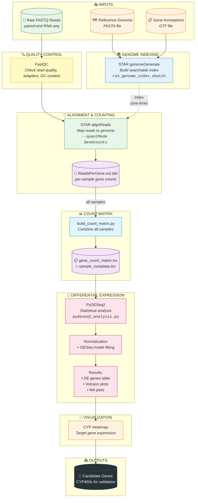
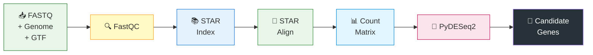
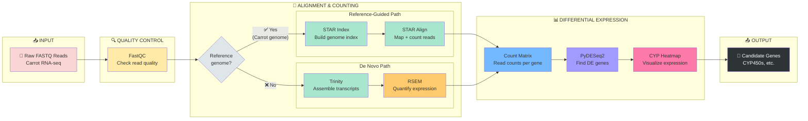

# RNA-Seq Pipeline Flowchart

Copy this into [mermaid.live](https://mermaid.live) to visualize.

---

## 🥕 Complete STAR Pipeline (Reference-Guided)

This is the **full execution flowchart** for the carrot RNA-seq analysis using STAR alignment.

### Master Flowchart

```mermaid
flowchart TB
    subgraph INPUTS["📥 STEP 0: INPUTS"]
        direction LR
        I1[("🧬 FASTQ Files<br/><code>*_1.fq.gz + *_2.fq.gz</code>")]
        I2[("🗺️ Genome FASTA<br/><code>GCF_001625215.2_DH1_v3.0_genomic.fna</code>")]
        I3[("📋 GTF Annotation<br/><code>dc_genomic.gtf</code>")]
    end

    subgraph STEP1["📚 STEP 1: GENOME INDEXING"]
        direction TB
        S1A["<b>run_genome_index.sbatch carrot</b>"]
        S1B["python -m rna_pipeline.cli<br/>--fasta genome.fna --gtf genes.gtf"]
        S1C["rna_pipeline/cli.py"]
        S1D["rna_pipeline/main.py<br/><i>run_index_workflow()</i>"]
        S1E["rna_pipeline/tools/star.py<br/><i>build_star_index_cmd()</i>"]
        S1F["STAR --runMode genomeGenerate"]
        S1G[("📁 carrot_star_index/<br/>Genome, SA, SAindex, etc.")]
        
        S1A --> S1B --> S1C --> S1D --> S1E --> S1F --> S1G
    end

    subgraph STEP2["🎯 STEP 2: ALIGNMENT + COUNTING"]
        direction TB
        S2A["<b>run_alignment.sbatch carrot 00_1_DC</b>"]
        S2B["python -m rna_pipeline.cli --mode align<br/>--genome-index ... --reads-left ... --quant-mode"]
        S2C["rna_pipeline/cli.py"]
        S2D["rna_pipeline/main.py<br/><i>run_align_workflow()</i>"]
        S2E["rna_pipeline/tools/star.py<br/><i>build_star_align_cmd()</i>"]
        S2F["STAR --runMode alignReads<br/>--quantMode GeneCounts"]
        S2G[("📄 *_Aligned.sortedByCoord.out.bam<br/>📄 *_ReadsPerGene.out.tab")]
        
        S2A --> S2B --> S2C --> S2D --> S2E --> S2F --> S2G
    end

    subgraph STEP3["📊 STEP 3: COUNT MATRIX"]
        direction TB
        S3A["<b>run_rnaseq_analysis.sbatch</b>"]
        S3B["python3 build_count_matrix.py<br/>/path/to/star/counts -o count_matrices"]
        S3C["build_count_matrix.py<br/><i>read_star_counts()</i><br/><i>extract_sample_info()</i><br/><i>build_count_matrix()</i>"]
        S3D[("📋 gene_count_matrix.tsv<br/>📋 sample_metadata.tsv<br/>📋 count_summary.txt")]
        
        S3A --> S3B --> S3C --> S3D
    end

    subgraph STEP4["🧪 STEP 4: DIFFERENTIAL EXPRESSION"]
        direction TB
        S4A["<b>run_pydeseq2_analysis.sbatch</b>"]
        S4B["python3 extract_cyp_families.py<br/>dc_genomic.gtf -o cyp_families.tsv"]
        S4C["python3 pydeseq2_analysis.py<br/>count_matrix.tsv metadata.tsv<br/>--cyp-family-map cyp_families.tsv"]
        S4D["pydeseq2_analysis.py<br/><i>run_pydeseq2_analysis()</i><br/><i>generate_cyp_heatmap()</i>"]
        S4E["PyDESeq2 Library<br/><i>DeseqDataSet</i><br/><i>DeseqStats</i>"]
        S4F[("📊 pydeseq2_results.tsv<br/>📊 deg_filtered.tsv<br/>📊 cyp_deg_filtered.tsv<br/>🎨 cyp_heatmap.pdf<br/>🎨 volcano_plot.pdf")]
        
        S4A --> S4B --> S4C --> S4D --> S4E --> S4F
    end

    subgraph OUTPUTS["📤 FINAL OUTPUTS"]
        O1[("🎯 Candidate CYP Genes<br/>Root-upregulated P450s")]
        O2[("📈 Publication Figures<br/>Heatmaps, Volcano plots")]
        O3[("📋 Gene Lists<br/>For validation/follow-up")]
    end

    %% Main flow connections
    I2 --> STEP1
    I3 --> STEP1
    
    STEP1 -->|"one-time"| STEP2
    I1 --> STEP2
    
    STEP2 -->|"per sample"| STEP3
    
    STEP3 --> STEP4
    I3 -->|"for CYP extraction"| STEP4
    
    STEP4 --> OUTPUTS

    %% Styling
    style INPUTS fill:#e8f5e9,stroke:#2e7d32
    style STEP1 fill:#e3f2fd,stroke:#1976d2
    style STEP2 fill:#fff3e0,stroke:#ef6c00
    style STEP3 fill:#f3e5f5,stroke:#7b1fa2
    style STEP4 fill:#fce4ec,stroke:#c2185b
    style OUTPUTS fill:#263238,color:#fff,stroke:#455a64
```



---

## 📋 Step-by-Step Execution Guide

### STEP 0: Setup - Download Genome, GTF, and Load FASTQ Files

Before running the pipeline, you need to set up your project directory with:
1. Reference genome (FASTA)
2. Gene annotations (GTF)
3. Raw sequencing reads (FASTQ)
4. This code repository

#### 0.1 Create Directory Structure

```bash
# SSH into Arc
ssh daisycortesj@owl1.arc.vt.edu

# Create project directories
cd /projects/tholl_lab_1/daisy_analysis
mkdir -p 00_rawdata      # Raw FASTQ files
mkdir -p 01_processed    # QC outputs
mkdir -p 02_mapped       # Alignment outputs
mkdir -p 03_count_tables # Count matrices
mkdir -p 04_reference    # Genome + GTF + STAR index
mkdir -p 05_rnaseq-code  # This repository
mkdir -p 06_analysis     # Final results
```

**Expected structure:**
```
/projects/tholl_lab_1/daisy_analysis/
├── 00_rawdata/           ← Your FASTQ files go here
├── 01_processed/
├── 02_mapped/
├── 03_count_tables/
├── 04_reference/         ← Genome + GTF go here
├── 05_rnaseq-code/       ← Clone this repo here
└── 06_analysis/
```

---

#### 0.2 Download Carrot Reference Genome and GTF

**Option A: Download directly on HPC (Recommended)**

```bash
# Go to reference directory
cd /projects/tholl_lab_1/daisy_analysis/04_reference

# Download carrot genome from NCBI
# Genome: Daucus carota (carrot) assembly DH1_v3.0
wget https://ftp.ncbi.nlm.nih.gov/genomes/all/GCF/001/625/215/GCF_001625215.2_DH1_v3.0/GCF_001625215.2_DH1_v3.0_genomic.fna.gz

# Download GTF annotation
wget https://ftp.ncbi.nlm.nih.gov/genomes/all/GCF/001/625/215/GCF_001625215.2_DH1_v3.0/GCF_001625215.2_DH1_v3.0_genomic.gtf.gz

# Decompress files
gunzip GCF_001625215.2_DH1_v3.0_genomic.fna.gz
gunzip GCF_001625215.2_DH1_v3.0_genomic.gtf.gz

# Rename for convenience (optional)
mv GCF_001625215.2_DH1_v3.0_genomic.gtf dc_genomic.gtf

# Verify files
ls -lh *.fna *.gtf
```

**Option B: Download on local machine, then transfer**

```bash
# On your LOCAL machine:
# Download from NCBI (use browser or curl)
curl -O https://ftp.ncbi.nlm.nih.gov/genomes/all/GCF/001/625/215/GCF_001625215.2_DH1_v3.0/GCF_001625215.2_DH1_v3.0_genomic.fna.gz
curl -O https://ftp.ncbi.nlm.nih.gov/genomes/all/GCF/001/625/215/GCF_001625215.2_DH1_v3.0/GCF_001625215.2_DH1_v3.0_genomic.gtf.gz

# Transfer to HPC using scp
scp *.gz daisycortesj@owl1.arc.vt.edu:/projects/tholl_lab_1/daisy_analysis/04_reference/

# Then on HPC, decompress:
ssh daisycortesj@owl1.arc.vt.edu
cd /projects/tholl_lab_1/daisy_analysis/04_reference
gunzip *.gz
```

**Verify genome files:**
```bash
# Check file sizes (genome ~426MB, GTF ~50MB)
ls -lh /projects/tholl_lab_1/daisy_analysis/04_reference/

# Preview genome (first 5 lines)
head -5 GCF_001625215.2_DH1_v3.0_genomic.fna
# Should show: >NC_030382.1 Daucus carota...

# Count chromosomes/scaffolds
grep -c "^>" GCF_001625215.2_DH1_v3.0_genomic.fna
# Expected: ~4,000+ (9 chromosomes + scaffolds)

# Preview GTF (first gene)
head -20 dc_genomic.gtf
```

---

#### 0.3 Upload/Transfer FASTQ Files

Your FASTQ files should be organized by sample group in `00_rawdata/`.

**Option A: Transfer from local machine**

```bash
# On your LOCAL machine:
# Transfer FASTQ files to HPC
scp -r /path/to/your/fastq/files/* \
    daisycortesj@owl1.arc.vt.edu:/projects/tholl_lab_1/daisy_analysis/00_rawdata/
```

**Option B: Copy from another HPC location**

```bash
# On HPC:
# Copy from sequencing facility output
cp -r /path/to/sequencing/output/* /projects/tholl_lab_1/daisy_analysis/00_rawdata/
```

**Option C: Download from SRA (if public data)**

```bash
# Load SRA toolkit
module load sratoolkit

# Download by accession
cd /projects/tholl_lab_1/daisy_analysis/00_rawdata
fastq-dump --split-files --gzip SRR1234567
```

**Expected FASTQ file structure:**
```
00_rawdata/
├── 00_1_DC/                    # Sample group 1 (e.g., Carrot variety DC)
│   ├── DC1L1_1.fq.gz          # Sample DC1L1, Read 1 (forward)
│   ├── DC1L1_2.fq.gz          # Sample DC1L1, Read 2 (reverse)
│   ├── DC1L2_1.fq.gz
│   ├── DC1L2_2.fq.gz
│   ├── DC1R1_1.fq.gz          # R = different condition (e.g., root)
│   ├── DC1R1_2.fq.gz
│   └── ...
├── 00_2_DG/                    # Sample group 2
│   ├── DGL1_1.fq.gz
│   ├── DGL1_2.fq.gz
│   └── ...
└── 00_3_MF/                    # Sample group 3
    └── ...
```

**Naming convention:**
```
{GROUP}{NUMBER}{CONDITION}{REPLICATE}_{READ}.fq.gz

Examples:
  DC1L1_1.fq.gz = DC group, #1, L condition, replicate 1, read 1
  DC1R2_2.fq.gz = DC group, #1, R condition, replicate 2, read 2
  DGL3_1.fq.gz  = DG group, L condition, replicate 3, read 1
```

**Verify FASTQ files:**
```bash
# List all FASTQ files
find /projects/tholl_lab_1/daisy_analysis/00_rawdata -name "*.fq.gz" | head -20

# Count total files (should be even number - paired-end)
find /projects/tholl_lab_1/daisy_analysis/00_rawdata -name "*.fq.gz" | wc -l

# Check file sizes (typically 1-10 GB each)
ls -lh /projects/tholl_lab_1/daisy_analysis/00_rawdata/00_1_DC/

# Preview a FASTQ file (first 4 lines = 1 read)
zcat /projects/tholl_lab_1/daisy_analysis/00_rawdata/00_1_DC/DC1L1_1.fq.gz | head -4
```

---

#### 0.4 Clone This Repository

```bash
# Go to code directory
cd /projects/tholl_lab_1/daisy_analysis/05_rnaseq-code

# Clone the repository (if not already done)
git clone https://github.com/YOUR_USERNAME/rnaseq.git .

# Or if already cloned, pull latest changes
git pull origin main
```

---

#### 0.5 Set Up Conda Environment

```bash
# Create conda environment (first time only)
conda env create -f environment.yml

# Activate environment
conda activate rnaseq

# Verify tools are installed
STAR --version
python --version
pip list | grep pydeseq2
```

---

#### 0.6 Verification Checklist

Before proceeding to Step 1, verify everything is in place:

```bash
# Run this checklist on HPC:

echo "=== VERIFICATION CHECKLIST ==="

# 1. Check genome exists
echo -n "Genome FASTA: "
if [ -f "/projects/tholl_lab_1/daisy_analysis/04_reference/GCF_001625215.2_DH1_v3.0_genomic.fna" ]; then
    echo "✓ Found"
else
    echo "✗ MISSING"
fi

# 2. Check GTF exists
echo -n "GTF annotation: "
if [ -f "/projects/tholl_lab_1/daisy_analysis/04_reference/dc_genomic.gtf" ]; then
    echo "✓ Found"
else
    echo "✗ MISSING"
fi

# 3. Check FASTQ files exist
echo -n "FASTQ files: "
FASTQ_COUNT=$(find /projects/tholl_lab_1/daisy_analysis/00_rawdata -name "*.fq.gz" 2>/dev/null | wc -l)
if [ "$FASTQ_COUNT" -gt 0 ]; then
    echo "✓ Found $FASTQ_COUNT files"
else
    echo "✗ MISSING"
fi

# 4. Check code repository
echo -n "Code repository: "
if [ -f "/projects/tholl_lab_1/daisy_analysis/05_rnaseq-code/scripts/run_genome_index.sbatch" ]; then
    echo "✓ Found"
else
    echo "✗ MISSING"
fi

# 5. Check conda environment
echo -n "Conda environment: "
if conda info --envs | grep -q "rnaseq"; then
    echo "✓ Found"
else
    echo "✗ MISSING"
fi

echo "=============================="
```

**Expected output:**
```
=== VERIFICATION CHECKLIST ===
Genome FASTA: ✓ Found
GTF annotation: ✓ Found
FASTQ files: ✓ Found 36 files
Code repository: ✓ Found
Conda environment: ✓ Found
==============================
```

---

#### Summary: Files Needed Before Starting

| File Type | Location | Source |
|-----------|----------|--------|
| **Genome FASTA** | `04_reference/GCF_001625215.2_DH1_v3.0_genomic.fna` | NCBI download |
| **GTF Annotation** | `04_reference/dc_genomic.gtf` | NCBI download |
| **FASTQ Files** | `00_rawdata/{sample_group}/*_1.fq.gz`, `*_2.fq.gz` | Sequencing facility |
| **Code Repository** | `05_rnaseq-code/` | Git clone |
| **Conda Environment** | `rnaseq` | `conda env create` |

---

### STEP 1: Build STAR Genome Index (One-Time)

```bash
# On HPC (Arc)
ssh daisycortesj@owl1.arc.vt.edu
source ~/.bashrc && conda activate rnaseq
cd /projects/tholl_lab_1/daisy_analysis/05_rnaseq-code

# Run indexing
sbatch scripts/run_genome_index.sbatch carrot
```

**Execution Flow:**
```
run_genome_index.sbatch carrot
        │
        ▼
python -m rna_pipeline.cli \
    --fasta .../GCF_001625215.2_DH1_v3.0_genomic.fna \
    --gtf .../dc_genomic.gtf \
    --outdir .../carrot_star_index
        │
        ▼
rna_pipeline/cli.py          → Parses arguments
        │
        ▼
rna_pipeline/main.py         → run_index_workflow()
        │
        ▼
rna_pipeline/tools/star.py   → build_star_index_cmd()
        │
        ▼
STAR --runMode genomeGenerate \
     --genomeDir carrot_star_index \
     --genomeFastaFiles genome.fna \
     --sjdbGTFfile genes.gtf
        │
        ▼
📁 OUTPUT: carrot_star_index/
    ├── Genome, SA, SAindex (binary index files)
    ├── chrName.txt, chrLength.txt (chromosome info)
    ├── exonInfo.tab, geneInfo.tab (gene annotations)
    └── sjdbList.out.tab (splice junctions)
```

---

### STEP 2: Align Reads + Count Genes

```bash
# Align all samples in a directory
sbatch scripts/run_alignment.sbatch carrot 00_1_DC
```

**Execution Flow:**
```
run_alignment.sbatch carrot 00_1_DC
        │
        ▼
FOR EACH sample (*_1.fq.gz) in 00_rawdata/00_1_DC/:
        │
        ▼
python -m rna_pipeline.cli \
    --mode align \
    --genome-index .../carrot_star_index \
    --reads-left DC1L1_1.fq.gz \
    --reads-right DC1L1_2.fq.gz \
    --quant-mode \
    --sample-name DC1L1
        │
        ▼
rna_pipeline/cli.py          → Parses --mode align
        │
        ▼
rna_pipeline/main.py         → run_align_workflow()
        │
        ▼
rna_pipeline/tools/star.py   → build_star_align_cmd()
        │
        ▼
STAR --runMode alignReads \
     --genomeDir carrot_star_index \
     --readFilesIn DC1L1_1.fq.gz DC1L1_2.fq.gz \
     --quantMode GeneCounts \
     --outSAMtype BAM SortedByCoordinate
        │
        ▼
📁 OUTPUT: 02_mapped/00_1_DC/
    ├── DC1L1_Aligned.sortedByCoord.out.bam (aligned reads)
    ├── DC1L1_ReadsPerGene.out.tab (gene counts) ⭐
    ├── DC1L1_Log.final.out (alignment statistics)
    └── DC1L1_SJ.out.tab (splice junctions)
```

---

### STEP 3: Build Count Matrix

```bash
# Combine all sample counts into one matrix
sbatch scripts/run_rnaseq_analysis.sbatch
```

**Execution Flow:**
```
run_rnaseq_analysis.sbatch
        │
        ▼
python3 build_count_matrix.py \
    /projects/.../03_count_tables/star \
    -o /projects/.../06_analysis/count_matrices
        │
        ▼
build_count_matrix.py
    │
    ├─► Find all *ReadsPerGene.out.tab files
    │
    ├─► FOR EACH file:
    │       ├─► parse_sample_name()     → "DC1L1"
    │       ├─► read_star_counts()      → DataFrame
    │       └─► extract_sample_info()   → {group, condition, replicate}
    │
    ├─► build_count_matrix()            → Merge all samples
    │
    └─► Save outputs
        │
        ▼
📁 OUTPUT: 06_analysis/count_matrices/
    ├── gene_count_matrix.tsv    (genes × samples) ⭐
    ├── sample_metadata.tsv      (sample info) ⭐
    └── count_summary.txt        (QC statistics)
```

---

### STEP 4: Differential Expression Analysis

```bash
# Full analysis with CYP heatmap
GTF_FILE=/projects/.../04_reference/dc_genomic.gtf \
ROOT_UP_ONLY=true \
sbatch scripts/run_pydeseq2_analysis.sbatch
```

**Execution Flow:**
```
run_pydeseq2_analysis.sbatch
        │
        ▼
┌─────────────────────────────────────────────────────┐
│ STEP 4A: Extract CYP Families from GTF              │
│                                                     │
│ python3 extract_cyp_families.py \                   │
│     dc_genomic.gtf -o cyp_families.tsv              │
│         │                                           │
│         ├─► Parse GTF for "cytochrome P450"         │
│         ├─► Extract CYP family (CYP71, CYP86...)    │
│         └─► Output: cyp_families.tsv                │
└─────────────────────────────────────────────────────┘
        │
        ▼
┌─────────────────────────────────────────────────────┐
│ STEP 4B: PyDESeq2 Differential Expression           │
│                                                     │
│ python3 pydeseq2_analysis.py \                      │
│     gene_count_matrix.tsv \                         │
│     sample_metadata.tsv \                           │
│     --contrast-factor condition \                   │
│     --contrast-A root --contrast-B leaf \           │
│     --cyp-family-map cyp_families.tsv \             │
│     --root-up-only                                  │
│         │                                           │
│         ├─► read_data()                             │
│         ├─► generate_qc_plots()                     │
│         ├─► run_pydeseq2_analysis()                 │
│         │       ├─► DeseqDataSet()                  │
│         │       ├─► Filter low counts               │
│         │       ├─► deseq2() (fit model)            │
│         │       └─► DeseqStats() (Wald test)        │
│         ├─► generate_volcano_plot()                 │
│         ├─► generate_ma_plot()                      │
│         └─► generate_cyp_heatmap()                  │
└─────────────────────────────────────────────────────┘
        │
        ▼
📁 OUTPUT: 06_analysis/pydeseq2_results/
    ├── pydeseq2_results.tsv      (all genes, full stats) ⭐
    ├── deg_filtered.tsv          (significant DEGs)
    ├── cyp_families.tsv          (gene → family mapping)
    ├── cyp_deg_filtered.tsv      (CYP DEGs only)
    ├── cyp_heatmap.pdf           (publication figure) ⭐
    ├── cyp_heatmap.png           (quick view)
    ├── pydeseq2_volcano_plot.pdf (significance plot) ⭐
    ├── pydeseq2_ma_plot.pdf      (expression plot)
    ├── qc_total_counts.pdf       (library QC)
    └── analysis_summary.txt      (statistics)
```

---

## 🗂️ Complete File Flow Diagram

```
📂 00_rawdata/
│   └── 00_1_DC/
│       ├── DC1L1_1.fq.gz ──────────┐
│       └── DC1L1_2.fq.gz ──────────┤
│                                   │
📂 04_reference/                    │
│   ├── genome.fna ─────────────────┼──► STEP 1: STAR Index
│   └── dc_genomic.gtf ─────────────┤         │
│                                   │         ▼
│                                   │   📂 04_reference/carrot_star_index/
│                                   │         │
│                                   └─────────┼──► STEP 2: STAR Align
│                                             │         │
│                                             │         ▼
│                                             │   📂 02_mapped/00_1_DC/
│                                             │   └── DC1L1_ReadsPerGene.out.tab
│                                             │         │
│                                             │         ▼
│                                             │   STEP 3: Build Matrix
│                                             │         │
│                                             │         ▼
│                                             │   📂 06_analysis/count_matrices/
│                                             │   ├── gene_count_matrix.tsv
│                                             │   └── sample_metadata.tsv
│                                             │         │
📂 04_reference/                              │         │
│   └── dc_genomic.gtf ───────────────────────┼─────────┤
│                                             │         ▼
│                                             │   STEP 4: PyDESeq2
│                                             │         │
│                                             │         ▼
│                                             │   📂 06_analysis/pydeseq2_results/
│                                             │   ├── pydeseq2_results.tsv
│                                             │   ├── cyp_heatmap.pdf
│                                             │   └── volcano_plot.pdf
│                                             │         │
│                                             │         ▼
│                                             │   🎯 CANDIDATE CYP GENES
```

---

## 🐍 Python Files Summary

| Step | SLURM Script | Python Files | Key Functions |
|------|--------------|--------------|---------------|
| **1. Index** | `run_genome_index.sbatch` | `cli.py` → `main.py` → `tools/star.py` | `build_star_index_cmd()` |
| **2. Align** | `run_alignment.sbatch` | `cli.py` → `main.py` → `tools/star.py` | `build_star_align_cmd()` |
| **3. Matrix** | `run_rnaseq_analysis.sbatch` | `build_count_matrix.py` | `read_star_counts()`, `build_count_matrix()` |
| **4. DE** | `run_pydeseq2_analysis.sbatch` | `extract_cyp_families.py` → `pydeseq2_analysis.py` | `run_pydeseq2_analysis()`, `generate_cyp_heatmap()` |

---

## ⏱️ Estimated Run Times

| Step | Time | Memory | Notes |
|------|------|--------|-------|
| **1. Index** | 2-4 hours | 128 GB | One-time only |
| **2. Align** | 1-2 hours/sample | 64 GB | Parallelizable |
| **3. Matrix** | 5-10 minutes | 32 GB | Fast |
| **4. DE** | 30-60 minutes | 32 GB | Depends on gene count |

---

## Your Pipeline (Reference-Guided)



## Simplified Linear View



## Full Pipeline with Both Paths



## Steps Explained

| Step | Tool | What it does | Script/File | Output |
|------|------|--------------|-------------|--------|
| 1. **Input** | - | Starting data | `00_rawdata/*.fastq.gz` | Paired-end reads |
| 2. **QC** | FastQC | Check read quality, adapters, GC | `fastqc` | HTML reports |
| 3. **Index** | STAR | Build genome index (one-time) | `run_genome_index.sbatch` | `*_star_index/` |
| 4. **Align + Count** | STAR | Map reads & count genes | `run_alignment.sbatch` | `*ReadsPerGene.out.tab` |
| 5. **Build Matrix** | Python | Combine all sample counts | `build_count_matrix.py` | `gene_count_matrix.tsv` |
| 6. **DE Analysis** | PyDESeq2 | Find differentially expressed genes | `pydeseq2_analysis.py` | `pydeseq2_results/` |
| 7. **Visualization** | Python | Heatmap of CYP genes | `pydeseq2_analysis.py` | Plots, CSVs |

## Key Clarification: STAR vs featureCounts

⚠️ **Your pipeline does NOT use featureCounts!**

STAR has a built-in counting mode (`--quantMode GeneCounts`) that counts reads per gene during alignment. This is:
- Faster (one step instead of two)
- Uses the same GTF file provided during indexing
- Outputs `ReadsPerGene.out.tab` files directly

```
Traditional:     STAR align → BAM → featureCounts → counts
Your pipeline:   STAR align + count → ReadsPerGene.out.tab  ✓
```

## Quick Reference

**Your workflow:**
```
FASTQ + Genome + GTF → FastQC → STAR Index → STAR Align → Count Matrix → PyDESeq2 → CYP Heatmap
```

**Why this path?** You have a reference genome for *Daucus carota* (carrot), so reference-guided alignment is more accurate than de novo assembly.

## Repository Structure

```
rnaseq/
├── 📄 environment.yml              # Conda environment (dependencies)
├── 📄 pyproject.toml               # Python package config
│
├── 📂 ReadME/                      # Documentation
│   ├── BEGINNER_GUIDE.md           #   Getting started guide
│   ├── PIPELINE_FLOWCHART.md       #   This file (pipeline overview)
│   └── PYDESEQ2_INTEGRATION.md     #   DE analysis documentation
│
├── 📂 scripts/                     # SLURM job submission scripts
│   ├── run_genome_index.sbatch     #   Build STAR index (Step 3)
│   ├── run_alignment.sbatch        #   Align single sample (Step 4)
│   ├── run_alignment_all.sbatch    #   Align all samples (Step 4)
│   ├── run_rnaseq_analysis.sbatch  #   Build count matrix (Step 5)
│   ├── run_pydeseq2_analysis.sbatch #  PyDESeq2 analysis (Step 6)
│   ├── run_trinity.sbatch          #   De novo assembly (alt path)
│   ├── run_trinity_all.sbatch      #   Trinity for all samples
│   ├── run_trinity_rsem_all.sbatch #   Trinity + RSEM quantification
│   ├── run_cyp_blast.sbatch        #   BLAST for CYP genes
│   └── run.sbatch                  #   Generic job template
│
├── 📄 build_count_matrix.py        # Combine STAR counts → matrix
├── 📄 pydeseq2_analysis.py         # Differential expression analysis
├── 📄 extract_cyp_families.py      # Extract CYP gene families
├── 📄 fix_trinity_paths.sh         # Trinity path helper
│
└── 📂 rna_pipeline/                # Python package (core logic)
    ├── __init__.py
    ├── cli.py                      #   Command-line interface (argparse)
    ├── main.py                     #   Pipeline orchestration
    ├── logging_setup.py            #   Console + file logging
    │
    ├── 📂 runners/
    │   └── local.py                #   Subprocess runner
    │
    ├── 📂 tools/                   # Tool-specific command builders
    │   ├── __init__.py
    │   ├── star.py                 #   STAR index & align commands
    │   ├── trinity.py              #   Trinity assembly commands
    │   ├── build_count_matrix.py   #   Count matrix builder
    │   └── rnaseq_analysis.R       #   R-based DE analysis (legacy)
    │
    └── 📂 utils/                   # Helper utilities
        ├── io_utils.py             #   File I/O helpers
        └── sys_utils.py            #   System utilities
```

## Project Data Locations (on HPC)

```
/projects/tholl_lab_1/daisy_analysis/
├── 📂 00_rawdata/           # Raw FASTQ files (*.fq.gz)
│   ├── 00_1_DC/             #   Carrot samples
│   ├── 00_2_DG/             #   ...
│   └── 00_3_MF/             #   ...
│
├── 📂 01_processed/         # QC outputs (FastQC HTML reports)
│
├── 📂 02_mapped/            # STAR alignment outputs
│   └── */                   #   Per-sample BAM + ReadsPerGene.out.tab
│
├── 📂 03_count_tables/      # Gene count matrices
│   └── star/                #   Combined count tables
│
├── 📂 04_reference/         # Reference data
│   ├── *.fna                #   Genome FASTA
│   ├── *.gtf                #   Gene annotations
│   ├── carrot_star_index/   #   STAR index (carrot)
│   └── nutmeg_star_index/   #   STAR index (nutmeg)
│
├── 📂 05_rnaseq-code/       # This repository (cloned here)
│
└── 📂 06_analysis/          # PyDESeq2 results
    ├── count_matrices/      #   Final count matrices
    ├── pydeseq2_results/    #   DE results, plots
    └── cyp_analysis/        #   CYP-specific outputs
```

## Script → Pipeline Step Mapping

| Pipeline Step | SLURM Script | Python Module | Output |
|---------------|--------------|---------------|--------|
| **1. QC** | (manual FastQC) | - | `01_processed/` |
| **2. Index** | `run_genome_index.sbatch` | `rna_pipeline.tools.star` | `*_star_index/` |
| **3. Align** | `run_alignment.sbatch` | `rna_pipeline.tools.star` | `*ReadsPerGene.out.tab` |
| **4. Count Matrix** | `run_rnaseq_analysis.sbatch` | `build_count_matrix.py` | `gene_count_matrix.tsv` |
| **5. DE Analysis** | `run_pydeseq2_analysis.sbatch` | `pydeseq2_analysis.py` | `pydeseq2_results/` |
| **6. CYP Analysis** | `run_cyp_blast.sbatch` | `extract_cyp_families.py` | CYP gene lists |
