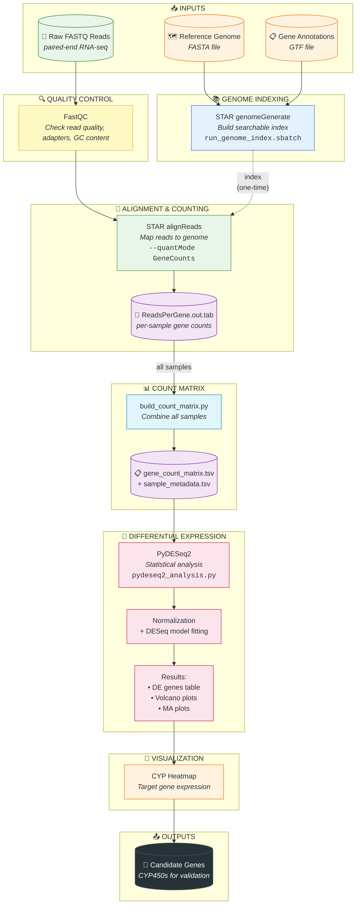
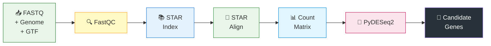
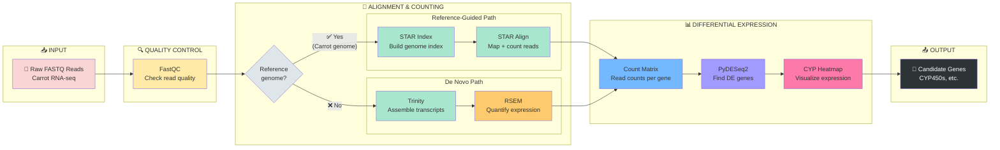

# RNA-Seq Pipeline Flowchart

Copy this into [mermaid.live](https://mermaid.live) to visualize.

## Your Pipeline (Reference-Guided)



## Simplified Linear View



## Full Pipeline with Both Paths



## Steps Explained

| Step | Tool | What it does | Script/File | Output |
|------|------|--------------|-------------|--------|
| 1. **Input** | - | Starting data | `00_rawdata/*.fastq.gz` | Paired-end reads |
| 2. **QC** | FastQC | Check read quality, adapters, GC | `fastqc` | HTML reports |
| 3. **Index** | STAR | Build genome index (one-time) | `run_genome_index.sbatch` | `*_star_index/` |
| 4. **Align + Count** | STAR | Map reads & count genes | `run_alignment.sbatch` | `*ReadsPerGene.out.tab` |
| 5. **Build Matrix** | Python | Combine all sample counts | `build_count_matrix.py` | `gene_count_matrix.tsv` |
| 6. **DE Analysis** | PyDESeq2 | Find differentially expressed genes | `pydeseq2_analysis.py` | `pydeseq2_results/` |
| 7. **Visualization** | Python | Heatmap of CYP genes | `pydeseq2_analysis.py` | Plots, CSVs |

## Key Clarification: STAR vs featureCounts

⚠️ **Your pipeline does NOT use featureCounts!**

STAR has a built-in counting mode (`--quantMode GeneCounts`) that counts reads per gene during alignment. This is:
- Faster (one step instead of two)
- Uses the same GTF file provided during indexing
- Outputs `ReadsPerGene.out.tab` files directly

```
Traditional:     STAR align → BAM → featureCounts → counts
Your pipeline:   STAR align + count → ReadsPerGene.out.tab  ✓
```

## Quick Reference

**Your workflow:**
```
FASTQ + Genome + GTF → FastQC → STAR Index → STAR Align → Count Matrix → PyDESeq2 → CYP Heatmap
```

**Why this path?** You have a reference genome for *Daucus carota* (carrot), so reference-guided alignment is more accurate than de novo assembly.

## Repository Structure

```
rnaseq/
├── 📄 environment.yml              # Conda environment (dependencies)
├── 📄 pyproject.toml               # Python package config
│
├── 📂 ReadME/                      # Documentation
│   ├── BEGINNER_GUIDE.md           #   Getting started guide
│   ├── PIPELINE_FLOWCHART.md       #   This file (pipeline overview)
│   └── PYDESEQ2_INTEGRATION.md     #   DE analysis documentation
│
├── 📂 scripts/                     # SLURM job submission scripts
│   ├── run_genome_index.sbatch     #   Build STAR index (Step 3)
│   ├── run_alignment.sbatch        #   Align single sample (Step 4)
│   ├── run_alignment_all.sbatch    #   Align all samples (Step 4)
│   ├── run_rnaseq_analysis.sbatch  #   Build count matrix (Step 5)
│   ├── run_pydeseq2_analysis.sbatch #  PyDESeq2 analysis (Step 6)
│   ├── run_trinity.sbatch          #   De novo assembly (alt path)
│   ├── run_trinity_all.sbatch      #   Trinity for all samples
│   ├── run_trinity_rsem_all.sbatch #   Trinity + RSEM quantification
│   ├── run_cyp_blast.sbatch        #   BLAST for CYP genes
│   └── run.sbatch                  #   Generic job template
│
├── 📄 build_count_matrix.py        # Combine STAR counts → matrix
├── 📄 pydeseq2_analysis.py         # Differential expression analysis
├── 📄 extract_cyp_families.py      # Extract CYP gene families
├── 📄 fix_trinity_paths.sh         # Trinity path helper
│
└── 📂 rna_pipeline/                # Python package (core logic)
    ├── __init__.py
    ├── cli.py                      #   Command-line interface (argparse)
    ├── main.py                     #   Pipeline orchestration
    ├── logging_setup.py            #   Console + file logging
    │
    ├── 📂 runners/
    │   └── local.py                #   Subprocess runner
    │
    ├── 📂 tools/                   # Tool-specific command builders
    │   ├── __init__.py
    │   ├── star.py                 #   STAR index & align commands
    │   ├── trinity.py              #   Trinity assembly commands
    │   ├── build_count_matrix.py   #   Count matrix builder
    │   └── rnaseq_analysis.R       #   R-based DE analysis (legacy)
    │
    └── 📂 utils/                   # Helper utilities
        ├── io_utils.py             #   File I/O helpers
        └── sys_utils.py            #   System utilities
```

## Project Data Locations (on HPC)

```
/projects/tholl_lab_1/daisy_analysis/
├── 📂 00_rawdata/           # Raw FASTQ files (*.fq.gz)
│   ├── 00_1_DC/             #   Carrot samples
│   ├── 00_2_DG/             #   ...
│   └── 00_3_MF/             #   ...
│
├── 📂 01_processed/         # QC outputs (FastQC HTML reports)
│
├── 📂 02_mapped/            # STAR alignment outputs
│   └── */                   #   Per-sample BAM + ReadsPerGene.out.tab
│
├── 📂 03_count_tables/      # Gene count matrices
│   └── star/                #   Combined count tables
│
├── 📂 04_reference/         # Reference data
│   ├── *.fna                #   Genome FASTA
│   ├── *.gtf                #   Gene annotations
│   ├── carrot_star_index/   #   STAR index (carrot)
│   └── nutmeg_star_index/   #   STAR index (nutmeg)
│
├── 📂 05_rnaseq-code/       # This repository (cloned here)
│
└── 📂 06_analysis/          # PyDESeq2 results
    ├── count_matrices/      #   Final count matrices
    ├── pydeseq2_results/    #   DE results, plots
    └── cyp_analysis/        #   CYP-specific outputs
```

## Script → Pipeline Step Mapping

| Pipeline Step | SLURM Script | Python Module | Output |
|---------------|--------------|---------------|--------|
| **1. QC** | (manual FastQC) | - | `01_processed/` |
| **2. Index** | `run_genome_index.sbatch` | `rna_pipeline.tools.star` | `*_star_index/` |
| **3. Align** | `run_alignment.sbatch` | `rna_pipeline.tools.star` | `*ReadsPerGene.out.tab` |
| **4. Count Matrix** | `run_rnaseq_analysis.sbatch` | `build_count_matrix.py` | `gene_count_matrix.tsv` |
| **5. DE Analysis** | `run_pydeseq2_analysis.sbatch` | `pydeseq2_analysis.py` | `pydeseq2_results/` |
| **6. CYP Analysis** | `run_cyp_blast.sbatch` | `extract_cyp_families.py` | CYP gene lists |
